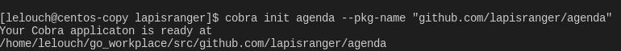
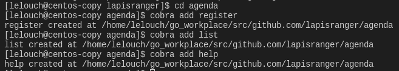
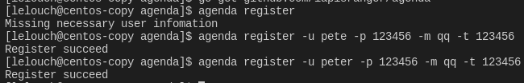
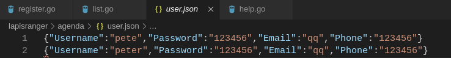
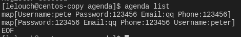
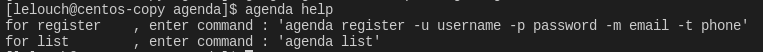

# agenda

## 实验过程

[作业网站](<https://pmlpml.github.io/ServiceComputingOnCloud/ex-cli-agenda>)

[作业项目Go Online分享链接](http://139.9.57.167:20080/share/bmk5age76kvmo1a88140?secret=false)

下载安装cobra.

在终端用cobra init命令创建一个命令行项目



使用cobra add添加3条命令



编辑cmd目录下的.go文件

在func init()函数中设置command的flag,即参数绑定

在Cmd的run部分编写命令执行的动作即可完成一个命令行的命令

以register.go为例

```go
func init() {
	rootCmd.AddCommand(registerCmd)

	// Here you will define your flags and configuration settings.

	// Cobra supports Persistent Flags which will work for this command
	// and all subcommands, e.g.:
	// registerCmd.PersistentFlags().String("foo", "", "A help for foo")

	// Cobra supports local flags which will only run when this command
	// is called directly, e.g.:
	// registerCmd.Flags().BoolP("toggle", "t", false, "Help message for toggle")
	registerCmd.Flags().StringP("username", "u", "", "/")
	registerCmd.Flags().StringP("password", "p", "", "/")
	registerCmd.Flags().StringP("email", "m", "", "/")
	registerCmd.Flags().StringP("phone", "t", "", "/")
}
```

这里绑定4个参数,包括全称和缩写,然后把输入的字符串传到执行命令部分

```go
var registerCmd = &cobra.Command{
	Use:   "register",
	Short: "Used to register an account",
	Long:  `User can register an account by enter username,password,email and phone`,
	Run: func(cmd *cobra.Command, args []string) {
		uname, _ := cmd.Flags().GetString("username")
		pwd, _ := cmd.Flags().GetString("password")
		mail, _ := cmd.Flags().GetString("email")
		phone_num, _ := cmd.Flags().GetString("phone")

		var flag = true
		if uname == "" || pwd == "" || mail == "" || phone_num == "" {
			fmt.Println("Missing necessary user infomation")
			flag = false
		}

		if flag {
			group := userAccount{
				Username: uname,
				Password: pwd,
				Email:    mail,
				Phone:    phone_num,
			}

			var filename = "user.json"
			var f *os.File
			var err error

			if checkFileIsExist(filename) {
				f, err = os.OpenFile(filename, os.O_WRONLY|os.O_APPEND, 0666)

			} else {
				f, err = os.Create(filename)

			}

			encoder := json.NewEncoder(f)
			err = encoder.Encode(group)

			if err != nil {
				fmt.Println("Register failed", err.Error())
			} else {
				fmt.Println("Register succeed")
			}
			f.Close()
		}

	},
}
```

这里使用了json格式的数据持久化.注册一个用户需要输入4条信息,然后打包成一个结构体userAccount,通过encoding/json包把该结构体转成json格式写出到user.json文件中(这里用到了辅助函数判断文件是否已经存在,若不存在则创建,若存在则附加写)

```go
func checkFileIsExist(filename string) bool {
	var exist = true
	if _, err := os.Stat(filename); os.IsNotExist(err) {
		exist = false
	}
	return exist
}

type userAccount struct {
	Username string
	Password string
	Email    string
	Phone    string
}
```

而在list.go中编写list命令输出user.json的信息

```go
var listCmd = &cobra.Command{
	Use:   "list",
	Short: "list user infomation",
	Long:  `list the first user infomation stored in user.json`,
	Run: func(cmd *cobra.Command, args []string) {
		f, err := os.Open("user.json")
		if err != nil {
			fmt.Println("Open file failed")
			return
		}
		var user interface{}
		decoder := json.NewDecoder(f)
		for {

			err = decoder.Decode(&user)
			if err != nil {
				fmt.Println(err.Error())
				break
			} else {
				fmt.Println(user)
			}
		}

		f.Close()
	},
}
```

这里每次decode只能读取一个对象,所以用了一个while循环,当err=EOF时终止循环读出user.json的所有用户账户信息

help.go比较简单,也不用绑定参数,只需要输出提示信息就可以了

### 测试

使用`go get github.com/lapisranger/agenda`命令安装agenda客户端程序

#### register





如果输入信息有一条为空会报错,成功输入后会生成user.json文件,可看到信息已经成功保存

#### list



输出user.json中的信息

#### help



输出提示信息
